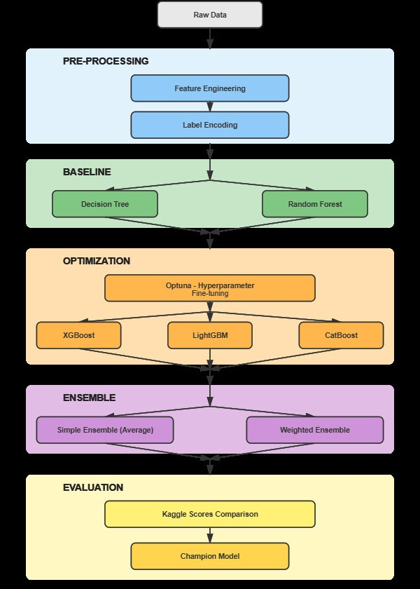
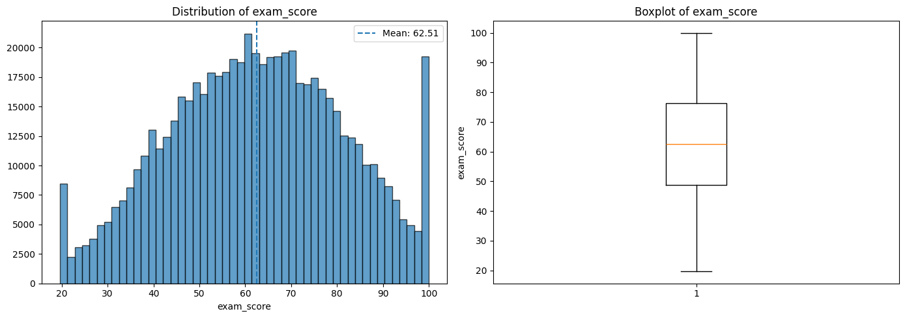
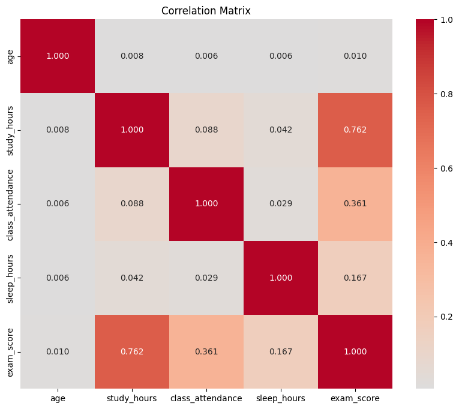

<div align="center">
  <a href="#en">English</a> • <a href="#pt-br">Português</a>
</div>

<a id="en"></a>

<div align="center">

# Kaggle Playground Series - Season 6, Episode 1: Predicting Student Performance

</div>

<div align="center">
  
  
  
  
  
  
  
</div>

## Objective

The main objective of this project is to develop a robust machine learning model to predict student performance based on a variety of demographic, socio-economic, and school-related features. The goal is to achieve the lowest possible Root Mean Square Error (RMSE), which serves as the evaluation metric for the [Kaggle Playground Series - Season 6, Episode 1](https://www.kaggle.com/competitions/playground-series-s6e1) competition.

The RMSE is calculated using the following formula:

$$ \text{RMSE} = \sqrt{\frac{1}{n} \sum_{i=1}^{n} (y_i - \hat{y}_i)^2} $$

Where:
- $ n $ is the number of observations
- $ y_i $ is the actual value
- $ \hat{y}_i $ is the predicted value

This repository documents the complete methodology, from exploratory analysis to the final ensemble model.

## Project Visualizations

<div align="center">
  
  <p><em>Project Methodology Flowchart</em></p>
</div>

<div align="center">
  
  <p><em>Exploratory Data Analysis</em></p>
</div>

<div align="center">
  
  <p><em>Correlation Matrix</em></p>
</div>

## Detailed Methodology

The project was developed following a structured pipeline to ensure reproducibility and high performance.

### 1. Preprocessing and Feature Engineering
This initial stage was crucial for preparing the data and extracting the maximum predictive signal.
- **Exploratory Data Analysis (EDA)**: I analyzed the distribution of variables, identified correlations, and visualized relationships between features to guide the modeling process.
- **Feature Engineering**: New features were created by combining existing ones. For example, I created interaction features between important variables (e.g., `'ParentalEducation' * 'FamilyIncome'`) and polynomial features for the most influential numerical columns. This helped to capture more complex, non-linear relationships.
- **Label Encoding**: Categorical features were converted into numerical format using `sklearn.preprocessing.LabelEncoder`. This method was chosen for its simplicity and efficiency with tree-based models.

### 2. Baseline Definition
To establish a performance benchmark, I implemented two standard models:
- **Decision Tree**: Chosen for its simplicity and interpretability, providing a quick initial result.
- **Random Forest**: Used as a more robust baseline, as it is an ensemble of decision trees and is less prone to overfitting than a single tree.
These models were trained without extensive hyperparameter tuning to get a preliminary sense of the problem's difficulty.

### 3. Hyperparameter Optimization (Fine-tuning)
This is the core of the project, where I sought to maximize the performance of the most powerful models.
- **Models**: XGBoost, LightGBM, and CatBoost were chosen for their high performance in tabular competitions.
- **Optimization with Optuna**: I used the Optuna framework to automate the search for hyperparameters. For each model, I defined an objective function to be minimized—the average Root Mean Squared Error (RMSE) across 5 folds of cross-validation. Optuna efficiently explores the hyperparameter space using a Bayesian optimization algorithm (TPE sampler), finding near-optimal combinations in fewer iterations than a random or grid search.

### 4. Ensemble Implementation
To further improve the results and create a more generalized model, I combined the predictions of the three optimized Boosting models.
- **Simple Ensemble**: This approach consists of calculating the arithmetic mean of the predictions. It is effective when the models have similar performance.
  - `Prediction = (XGB_pred + LGBM_pred + CAT_pred) / 3`
- **Weighted Ensemble**: This method assigns a different weight to each model's prediction based on its individual performance. The weights were calculated as the inverse of the CV RMSE score, giving more importance to models with lower error.
  - `weight_i = 1 / CV_RMSE_i`
  - `Prediction = Σ(weight_i * pred_i) / Σ(weight_i)`
- **Final Model Weights**: The final weighted ensemble uses the following weights based on model performance:
  - `peso_xgb = 0.5`
  - `peso_lgbm = 0.35`
  - `peso_catboost = 0.15`

## 📊 Results and Analysis

The table below summarizes the performance of each model, comparing the average Cross-Validation (CV) score with the final score on the Kaggle leaderboard.

| Model                 | Mean Cross-Validation (RMSE) | Final Kaggle Score (RMSE) |
| --------------------- | ------------------------------ | --------------------------- |
| **Weighted Ensemble**   | **8.72208**                    | **8.68800**                 |
| Simple Ensemble       | 8.72426                        | 8.69076                     |
| XGBoost Individual    | 8.73006                        | 8.69638                     |
| LightGBM Individual   | 8.73642                        | 8.69684                     |
| CatBoost Individual   | 8.75078                        | 8.72010                     |
| Random Forest         | *Not recorded*                 | 8.90920                     |
| Decision Tree         | *Not recorded*                 | 11.19945                    |

*Note: Decision Tree and Random Forest were used as baseline models, and their CV data was not recorded during the final optimization phase.*

### Analysis of Results
- **Ensemble Superiority**: Both ensemble methods outperformed the individual models, demonstrating the effectiveness of combining different models to reduce variance and improve generalization.
- **Weighted Ensemble Advantage**: The Weighted Ensemble achieved the best score, both in local CV and on the Kaggle leaderboard. This indicates that assigning weights based on model performance was a successful strategy.
- **CV vs. Kaggle Score**: There is a positive correlation between the local CV scores and the final Kaggle scores. The improvement in CV was consistently reflected in the private leaderboard, validating the robustness of the cross-validation strategy.

## 🚀 How to Reproduce

1.  **Clone the repository**:
    ```bash
    git clone https://github.com/YOUR_USERNAME/kaggle-playground-s6e1.git
    cd kaggle-playground-s6e1
    ```
2.  **Install dependencies**:
    ```bash
    pip install -r requirements.txt
    ```
    *(Note: A `requirements.txt` file should be created for a complete project)*
3.  **Run the notebooks**: Open and run the Jupyter Notebooks in the root directory (e.g., `Predicting_Student_Test_Scores_PT.ipynb`) to see the complete process.

## 📁 Folder Organization

The repository is organized for clarity and ease of navigation:

-   `/data`: Contains the original competition datasets (`train.csv`, `test.csv`).
-   `/` (root): Contains the main training, analysis, and modeling notebooks (`.ipynb`).
-   `/tuning_results`: Stores detailed logs from the Optuna optimization trials and cross-validation scores for each model.
-   `/models` and `/submissions`: Contain the final CSV files generated for submission to the Kaggle competition leaderboard.

---

<a id="pt-br"></a>

<div align="center">

# Kaggle Playground Series - Temporada 6, Episódio 1: Previsão de Desempenho de Estudantes

</div>

<div align="center">
  
  
  
  
  
  
  
</div>

## Objetivo

O objetivo principal deste projeto é desenvolver um modelo de machine learning robusto para prever o desempenho de estudantes com base em uma variedade de características demográficas, socioeconômicas e escolares. O objetivo é obter o menor Root Mean Square Error (RMSE) possível, que serve como métrica de avaliação para a competição [Kaggle Playground Series - Season 6, Episode 1](https://www.kaggle.com/competitions/playground-series-s6e1).

O RMSE é calculado usando a seguinte fórmula:

$$ \text{RMSE} = \sqrt{\frac{1}{n} \sum_{i=1}^{n} (y_i - \hat{y}_i)^2} $$

Onde:
- $ n $ é o número de observações
- $ y_i $ é o valor real
- $ \hat{y}_i $ é o valor previsto

Este repositório documenta a metodologia completa, desde a análise exploratória até o modelo final de ensemble.

## Visualizações do Projeto

<div align="center">
  
  <p><em>Fluxograma da Metodologia do Projeto</em></p>
</div>

<div align="center">
  
  <p><em>Análise Exploratória de Dados</em></p>
</div>

<div align="center">
  
  <p><em>Matriz de Correlação</em></p>
</div>

## Metodologia Detalhada

O projeto foi desenvolvido seguindo um pipeline estruturado para garantir reprodutibilidade e alta performance.

### 1. Pré-processamento e Engenharia de Features
Esta etapa inicial foi crucial para preparar os dados e extrair o máximo de sinal preditivo.
- **Análise Exploratória de Dados (EDA)**: Analisei a distribuição das variáveis, identifiquei correlações e visualizei as relações entre as features para guiar o processo de modelagem.
- **Engenharia de Features**: Novas features foram criadas combinando as existentes. Por exemplo, criei features de interação entre variáveis importantes (ex: `'ParentalEducation' * 'FamilyIncome'`) e features polinomiais para as colunas numéricas mais influentes. Isso ajudou a capturar relações mais complexas e não-lineares.
- **Label Encoding**: As features categóricas foram convertidas para formato numérico utilizando `sklearn.preprocessing.LabelEncoder`. Este método foi escolhido por sua simplicidade e eficiência com modelos baseados em árvores.

### 2. Definição de Baseline
Para estabelecer um benchmark de desempenho, implementei dois modelos padrão:
- **Decision Tree**: Escolhido por sua simplicidade e interpretabilidade, fornecendo um resultado inicial rápido.
- **Random Forest**: Utilizado como uma baseline mais robusta, pois é um ensemble de árvores de decisão e é menos propenso a overfitting do que uma única árvore.
Esses modelos foram treinados sem um ajuste extensivo de hiperparâmetros para obter uma noção preliminar da dificuldade do problema.

### 3. Otimização de Hiperparâmetros (Fine-tuning)
Este é o núcleo do projeto, onde busquei maximizar o desempenho dos modelos mais poderosos.
- **Modelos**: XGBoost, LightGBM e CatBoost foram escolhidos por sua alta performance em competições com dados tabulares.
- **Otimização com Optuna**: Utilizei o framework Optuna para automatizar a busca por hiperparâmetros. Para cada modelo, defini uma função objetivo a ser minimizada — a média do Root Mean Squared Error (RMSE) em 5 folds de validação cruzada. O Optuna explora o espaço de hiperparâmetros de forma eficiente usando um algoritmo de otimização Bayesiana (sampler TPE), encontrando combinações quase ótimas em menos iterações do que uma busca aleatória ou em grade.

### 4. Implementação de Ensemble
Para melhorar ainda mais os resultados e criar um modelo mais generalista, combinei as previsões dos três modelos de Boosting otimizados.
- **Ensemble Simples**: Essa abordagem consiste em calcular a média aritmética das previsões. É eficaz quando os modelos têm desempenho semelhante.
  - `Previsão = (XGB_pred + LGBM_pred + CAT_pred) / 3`
- **Ensemble Ponderado**: Este método atribui um peso diferente à previsão de cada modelo com base em seu desempenho individual. Os pesos foram calculados como o inverso do score RMSE da CV, dando mais importância aos modelos com menor erro.
  - `peso_i = 1 / CV_RMSE_i`
  - `Previsão = Σ(peso_i * pred_i) / Σ(peso_i)`
- **Pesos Finais do Modelo**: O ensemble ponderado final usa os seguintes pesos baseados no desempenho do modelo:
  - `peso_xgb = 0.5`
  - `peso_lgbm = 0.35`
  - `peso_catboost = 0.15`

## 📊 Resultados e Análise

A tabela abaixo resume o desempenho de cada modelo, comparando o score médio da Validação Cruzada (CV) com o score final no leaderboard do Kaggle.

| Modelo                  | Média da Validação Cruzada (RMSE) | Score Final no Kaggle (RMSE) |
| ----------------------- | ----------------------------------- | ---------------------------- |
| **Ensemble Ponderado**  | **8.72208**                         | **8.68800**                  |
| Ensemble Simples        | 8.72426                             | 8.69076                      |
| XGBoost Individual      | 8.73006                             | 8.69638                      |
| LightGBM Individual     | 8.73642                             | 8.69684                      |
| CatBoost Individual     | 8.75078                             | 8.72010                      |
| Random Forest           | *Não registrado*                    | 8.90920                      |
| Decision Tree           | *Não registrado*                    | 11.19945                     |

*Nota: Decision Tree e Random Forest foram utilizados como modelos de baseline, e seus dados de CV não foram registrados durante a fase final de otimização.*

### Análise dos Resultados
- **Superioridade dos Ensembles**: Ambos os métodos de ensemble superaram os modelos individuais, demonstrando a eficácia de combinar diferentes modelos para reduzir a variância e melhorar a generalização.
- **Vantagem do Ensemble Ponderado**: O Ensemble Ponderado alcançou o melhor score, tanto na CV local quanto no leaderboard do Kaggle. Isso indica que a atribuição de pesos com base no desempenho do modelo foi uma estratégia bem-sucedida.
- **CV vs. Score Kaggle**: Há uma correlação positiva entre os scores da CV local e os scores finais do Kaggle. A melhoria na CV foi consistentemente refletida no leaderboard privado, validando a robustez da estratégia de validação cruzada.

## 🚀 Como Reproduzir

1.  **Clone o repositório**:
    ```bash
    git clone https://github.com/SEU_USUARIO/kaggle-playground-s6e1.git
    cd kaggle-playground-s6e1
    ```
2.  **Instale as dependências**:
    ```bash
    pip install -r requirements.txt
    ```
    *(Observação: Um arquivo `requirements.txt` deve ser criado para um projeto completo)*
3.  **Execute os notebooks**: Abra e execute os Jupyter Notebooks no diretório raiz (ex: `Predicting_Student_Test_Scores_PT.ipynb`) para ver o processo completo.

## 📁 Organização de Pastas

O repositório está organizado para clareza e facilidade de navegação:

-   `/data`: Contém os datasets originais da competição (`train.csv`, `test.csv`).
-   `/` (raiz): Contém os notebooks principais de treinamento, análise e modelagem (`.ipynb`).
-   `/tuning_results`: Armazena logs detalhados dos trials de otimização do Optuna e os scores da validação cruzada para cada modelo.
-   `/models` e `/submissions`: Contêm os arquivos CSV finais gerados para submissão ao leaderboard da competição Kaggle.